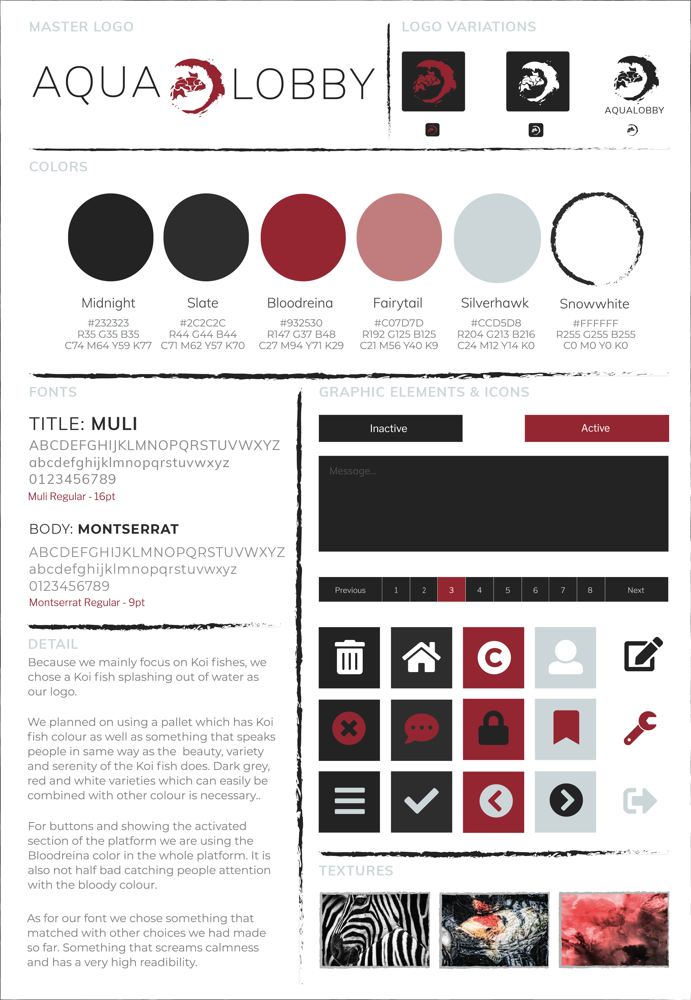

<section data-markdown>
    <textarea data-template>
        # PRODUCTIEDOSSIER
    </textarea>
</section>

<section data-markdown>
    <textarea data-template>
        ## I. DISCOVER
    </textarea>
</section>

<section data-markdown>
    <textarea data-template>
        ### Briefing

        Een thematisch veilingsplatform om kopers en verkopers in contact te brengen. 
        
        - Frontoffice -> Eindgebruiker

        - Backoffice -> Beheerder

        - API -> Communiticate

    </textarea>
</section>

<section data-markdown>
    <textarea data-template>
        ## II. DEFINE
    </textarea>
</section>

<section data-markdown>
    <textarea data-template>
        ### Concept - AquaLobby

        ---

        Een veiling platform creëren voor:

        - Kwekers

        - Hobbyisten

        - Bedrijven

        - Gewone mensen

        Waarbij verschillende soorten van koi vissen geveild kunnen worden.
    </textarea>
</section>

<section data-markdown>
    <textarea data-template>
        ### Planning

        ---

        Gantt Chart Data

            
    </textarea>    
</section>

<section data-markdown>
    <textarea data-template>
        ### Planning

        ---

        Gantt Chart Graph
   
        
    </textarea>    
</section>

<section data-markdown>
    <textarea data-template>
        ### Planning

        ---

        Work Breakdown Structure

        
    </textarea>
</section>

<section data-markdown>
    <textarea data-template>
        ### Concurrenten Analyse

        ---

        Concurrenten Analyse in tabel
        
        

    </textarea>
</section>

<section data-markdown>
    <textarea data-template style="font-size:12px">
        ### Afgewerkte Requirements Backoffice
        - Verschillende rollen (Admin, Moderator & Customer),
        - Authenticatie van beheerders (Customer of Guest niet toegelaten),
        - Beheer van beheerders (Admin mag alles, Mod niet),
        - Beheer van customers & vissen (CRUD),
        - Beheer van categorieën & subcategoriën (Moderator mag alleen Subcategorieën),
        - ...
    </textarea>
</section>

<section data-markdown>
    <textarea data-template>
        ### Afgewerkt Requirements Frontoffice
        - Verschillende rollen (Bezoeker, Gebruiker),
        - Registratie (Customer of Guest),
        - Authenticatie van klanten (JWT, password reset),
        - Beheer van vissen & bids (create, publish, unpublish)
        - Lijst/detail van bid, plaatsen, filteren, ...,
        - ...

    </textarea>
</section>

<section data-markdown>
    <textarea data-template>
        ## III. DESIGN
    </textarea>
</section>

<section data-markdown>
    <textarea data-template>
        ### Data Model
    </textarea>
</section>

<section data-markdown>
    <textarea data-template class="bigImage">
    
    </textarea>
</section>

<section data-markdown>
    <textarea data-template>
        ### Sitemap

        ---
         
    </textarea>
</section>

<section data-markdown>
    <textarea data-template>
        Wireframes - Backoffice - 0.0.0 Login

        
    </textarea>
</section>

<section data-markdown>
    <textarea data-template>
         Wireframes - Backoffice - 1.0.0 Dashboard
        
    </textarea>
</section>

<section data-markdown>
    <textarea data-template>
        Wireframes - Backoffice - 1.3.0 Fishes
        
    </textarea>
</section>

<section data-markdown>
    <textarea data-template>
        Wireframes - Backoffice - 1.X.1 Add XXXX
        
    </textarea>
</section>

<section data-markdown>
    <textarea data-template>
        Style Tile
    </textarea>
</section>

<section data-markdown>
    <textarea data-template>
         
    </textarea>
</section>

<section data-markdown>
    <textarea data-template>
        Screen Designs Backoffice - 0.0.0 login

           
    </textarea>
</section>

<section data-markdown>
    <textarea data-template>
         Screen Designs - Backoffice - 1.0.0 Dashboard
        
    </textarea>
</section>

<section data-markdown>
    <textarea data-template>
        Screen Designs - Backoffice - 1.3.0 Fishes
        
    </textarea>
</section>

<section data-markdown>
    <textarea data-template>
        Screen Designs - Backoffice - 1.X.1 Add XXXX
        
    </textarea>
</section>

<section data-markdown>
    <textarea data-template>
        Screen Designs - Frontoffice - Login

 
    </textarea>
</section>

<section data-markdown>
    <textarea data-template>
        Screen Designs - Frontoffice - Auctions
        
    </textarea>
</section>

<section data-markdown>
    <textarea data-template>
         Screen Designs - Frontoffice - Fishdetail
        
    </textarea>
</section>

<section data-markdown>
    <textarea data-template>
        Screen Designs - Frontoffice - Add Form
        
    </textarea>
</section>

<section data-markdown>
    <textarea data-template>
        Screen Designs - Frontoffice - FAQ
        
    </textarea>
</section>

<section data-markdown>
    <textarea data-template>
        ### 6. Style Guide
    </textarea>
</section>

<section data-markdown>
    <textarea data-template>
         
    </textarea>
</section>

<section data-markdown>
    <textarea data-template>
        ## IV. DEVELOP
    </textarea>
</section>

<section data-markdown>
    <textarea data-template>
        ## V. DELIVER
    </textarea>
</section>

<section data-markdown>
    <textarea data-template>
        ## VI. DEPLOY
    </textarea>
</section>
